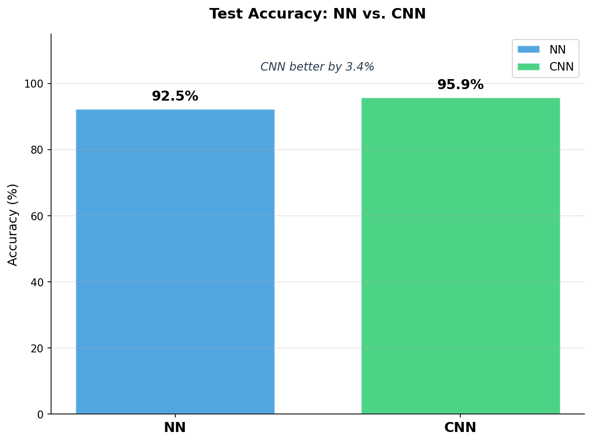
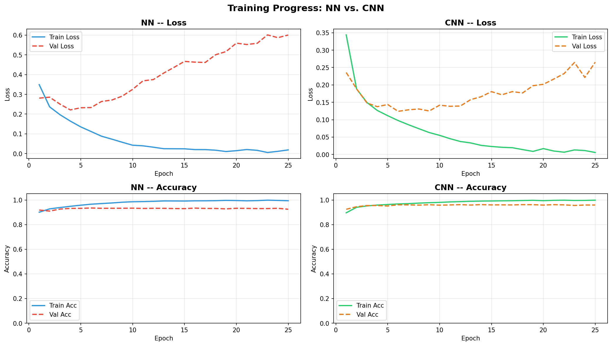
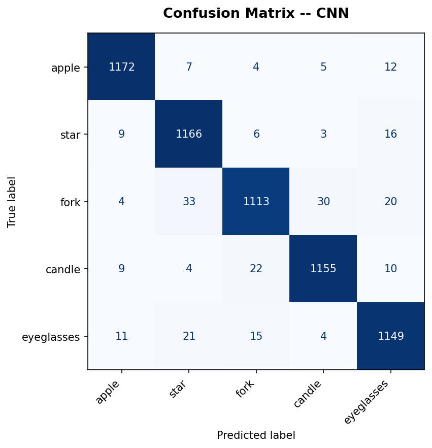
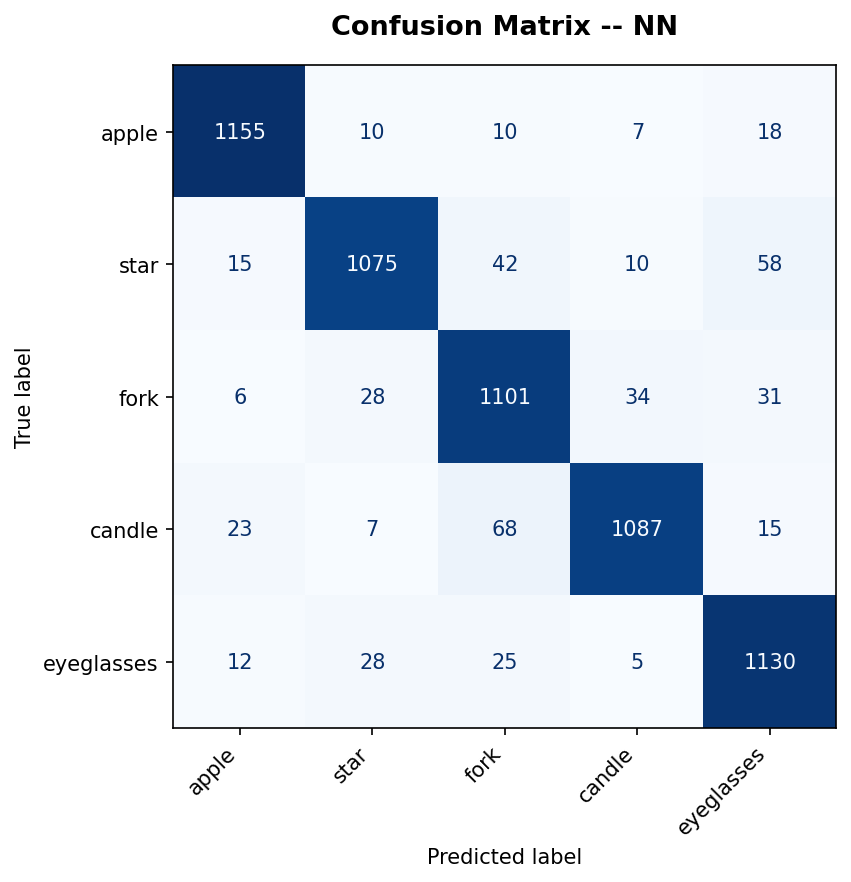
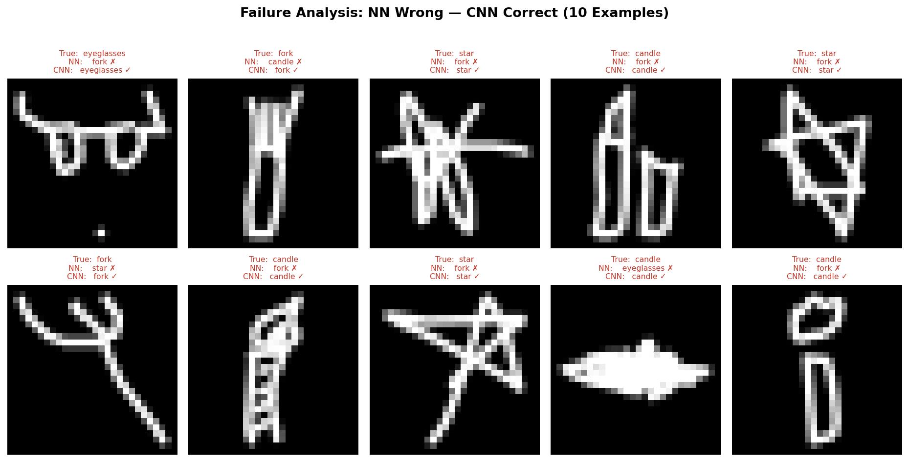

# QuickDraw Sketch Classifier — CNN vs. NN

> A deep learning system that classifies hand-drawn sketches in real time,
> comparing a  Fully Connected Neural Network (NN) with a Convolutional Neural Network (CNN) on the [Google QuickDraw](https://github.com/googlecreativelab/quickdraw-dataset) dataset.

🎯 **Live Prediction Demo:**
- Draw a sketch → model predicts instantly
- Both models are loaded simultaneously for instant switching 
- Compare predictions in real time


---

## Results

| Model | Test Accuracy | Parameters |
|-------|--------------|------------|
| NN    | 93.4%        | ~109k      |
| **CNN**   | **96.2%**    | **~56k**   |

CNN achieves **+2.8% higher accuracy** using **50% fewer parameters** — demonstrating the advantage of spatial feature learning for image data.

---

## Visualizations

### Accuracy Comparison


### Training Curves — Loss & Accuracy


### Confusion Matrix — CNN


### Confusion Matrix — NN


### Failure Analysis — Where NN fails, CNN succeeds


---

## Classes
| Label | Class |
|-------|-------|
| 0 | 🍎 Apple |
| 1 | ⭐ Star |
| 2 | 🍴 Fork |
| 3 | 🕯️ Candle |
| 4 | 👓 Eyeglasses |

---

## Model Architectures

**NN Baseline**
```
Input(784) → Linear(128) → ReLU → Linear(64) → ReLU → Linear(5)
```

**CNN Main Model**
```
Input(1,28,28) → Conv2d(16,3×3) → ReLU → MaxPool
              → Conv2d(32,3×3) → ReLU → MaxPool
              → Flatten → Linear(64) → Linear(5)
```

---

## Tech Stack

| Area | Tools |
|------|-------|
| ML / Training | PyTorch (CUDA), NumPy, scikit-learn |
| Visualization | Matplotlib |
| Backend API | FastAPI, Uvicorn |
| Desktop UI | Tkinter, Pillow |
| Web Frontend | React |
| Hardware | NVIDIA RTX 4060 (CUDA 12.4) |

---

## Project Structure

```
quickdraw-sketch-classifier/
├── src/
│   ├── preprocessing.py   # Data pipeline
│   ├── models.py          # NN + CNN architectures
│   ├── train.py           # Training loop
│   ├── evaluate.py        # Validation
│   └── visualize.py       # Matplotlib plots
├── tests/                 # pytest tests
├── assets/                # Training results & plots
├── results/               # Metrics (JSON)
├── config.py              # Hyperparameters
├── main.py                # Training entrypoint
├── api.py                 # FastAPI backend
├── ui.py                  # Tkinter desktop app
├── start.bat              # One-click start (Windows)
└── requirements.txt
```

---

## Setup & Usage

### 1. Install dependencies
```bash
pip install -r requirements.txt
```

### 2. Download data
```bash
python src/download_data.py
```

### 3. Train models
```bash
python main.py
```

### 4. Run desktop UI (no server needed)
```bash
python ui.py
```

### 5. Run web UI
```bash
# Terminal 1
uvicorn api:app --port 8000

# Terminal 2
cd quickdraw-ui && npm start
```

---

## Key Findings

1. **CNN is more efficient** — shared weights reduce parameters by 50% while improving accuracy
2. **Translation invariance** — CNN correctly classifies objects regardless of position; NN does not
3. **Overfitting** — NN shows a 6.6% train/val accuracy gap vs. 3.9% for CNN
4. **Failure cases** — NN confuses structurally similar classes (fork/candle); CNN distinguishes local edge patterns

---

## Tests

```bash
pytest tests/ -v
```

---

*Built with PyTorch · RTX 4060 · Python 3.12*
